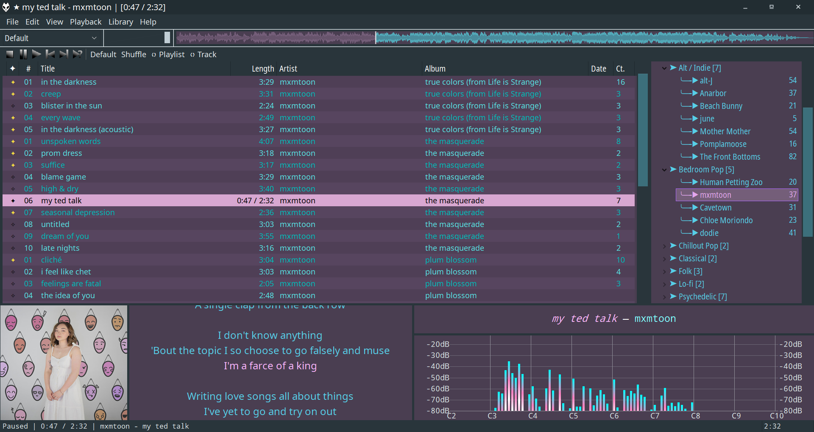

# Violet Exoplanet

A flat, minimal foobar2000 (v1.6) ColumnsUI theme.



Table of Contents
===

<!--ts-->
   * [Description](#description)
   * [Getting Started](#getting-started)
      * [Packages](#packages)
      * [Installation](#installation)
         * [Components](#components)
         * [Layout](#layout)
   * [Scripts](#scripts)
      * [Installing Themes](#installing-themes)
      * [Violet Exoplanet Theme](#violet-exoplanet-theme)
<!--te-->

## Description

Violet Exoplanet has three goals as a theme:

* Be easy on the eyes and/or reduce eye-strain
* Create a flat, aesthetically pleasing UI
* Optimize UX via panel configurations

This theme utilizes a handful of custom title and style scripts. These scripts are built into `violet_exoplanet.fcl`, but I will provide each script for convenience (TODO).

Note: I have used the custom Windows 10 theme, ["Adapta," by niivu](https://www.deviantart.com/niivu/art/Adapta-675581778) on Deviant Art. This theme is responsible for the coloration of the titlebar and scrollbars, among other things.

## Getting Started

(2023-07-19) I found out that because of the package dependencies, this layout no longer works in the v2.0 of foobar2000. I have tested it, and it currently works in v1.6.16.
(2025-09-08) I looked into it more, and it seems like the/another issue is that `foo_plorg` and `foo_wave_minibar_mod` are 32-bit, and thus will not work with the default 64-bit installation of foobar2000.

### Packages

These packages are required for all panels to function correctly.

* [Columns UI (foo_ui_columns)](https://www.foobar2000.org/components/view/foo_ui_columns)
* [Musical Spectrum (foo_musical_spectrum)](https://hydrogenaud.io/index.php/topic,97404.0.html)
* [OpenLyrics (foo_openlyrics)](https://www.foobar2000.org/components/view/foo_openlyrics)
* [Playlist Organizer (foo_plorg)](https://www.foobar2000.org/components/view/foo_plorg)
* [Playback Statistics (foo_playcount)](https://www.foobar2000.org/components/view/foo_playcount)
* [Waveform Minibar (foo_wave_minibar_mod)](https://www.foobar2000.org/components/view/foo_wave_minibar_mod)
* [Queue Contents Editor (foo_queuecontents)](https://www.foobar2000.org/components/view/foo_queuecontents)

### Installation

Install all components before installing the theme. If you have an existing theme, you should export it before going forward.

#### Components

Note: it is highly recommended to install components using fb2k's component manager. They will work if put into the program's component folder, but this prevents fb2k from automatically updating them.

* Download the components from the links provided above.
>
* foobar2000 may attempt to automatically install it but, if not, you can use the built-in component manager.
>
* With foobar2000 open, navigate to the component manager.
    * **Library** > **Configure** > **Components**
>
* Click the "Install..." button.
>
* Navigate to your download folder and double-click the components to install.
>
* When every component has been installed, click "Apply."
>
* foobar2000 will need to restart to finish the installation.

#### Layout

* Clone repository to desired location, or to the fb2k installation folder.
    * Default installation path is `\Program Files (x86)\foobar2000`.
>
* With foobar2000 open, navigate to Columns UI's "Main" settings.
    * **Library** > **Configure** > **Display** > **Columns UI** > **Main**
>
* Click the "Import configuration..." button.
>
* Navigate to `violet_exoplanet\layout` and import `violet_exoplanet.fcl`.

## Scripts

### Installing Themes

* With foobar2000 open, navigate to Columns UI's "Main" settings.
>
* **Library** > **Configure** > **Display** > **Columns UI** > **Playlist view** > **Globals**
>
* Under **Globals**, go to the **Style** tab.
>
* Leave **Use global variables for display** and **Use global variables when sorting by column** unchecked.
>
* Paste in (and/or write your own) the theme script into the text box, then click **Apply**.

### Violet Exoplanet Theme
---
```
$ifequal($mod(%list_index%,2),0,
$puts(back,
$rgb(87, 69, 95)),
$puts(back,
$rgb(79, 63, 86))
)

$puts(back-selected,
$rgb(125, 98, 132)
)
$puts(back-selected-unfocused,
$rgb(125, 98, 132)
)
$set_style(back,
$get(back),$get(back-selected),$get(back-selected-unfocused)
)

$ifequal($mod(%list_index%,2),0,
$puts(text,
$rgb(0, 191, 187)
),
$puts(text,
$rgb(88, 231, 231))
)

$puts(text-selected,
$rgb(249, 180, 252)
)
$puts(text-selected-unfocused,
$rgb(249, 180, 252)
)
$set_style(text,
$get(text),$get(text-selected),$get(text-selected-unfocused)
)

$if(%isplaying%,
$set_style(back,
$rgb(216,167,209),$rgb(216,167,209))
)
$if(%isplaying%,
$set_style(text,
$rgb(0,0,0),$rgb(0,0,0))
)
```
